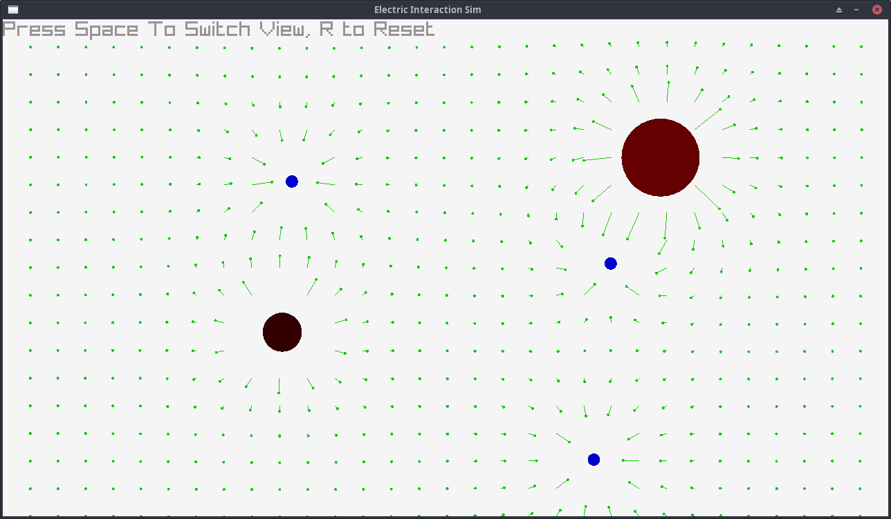
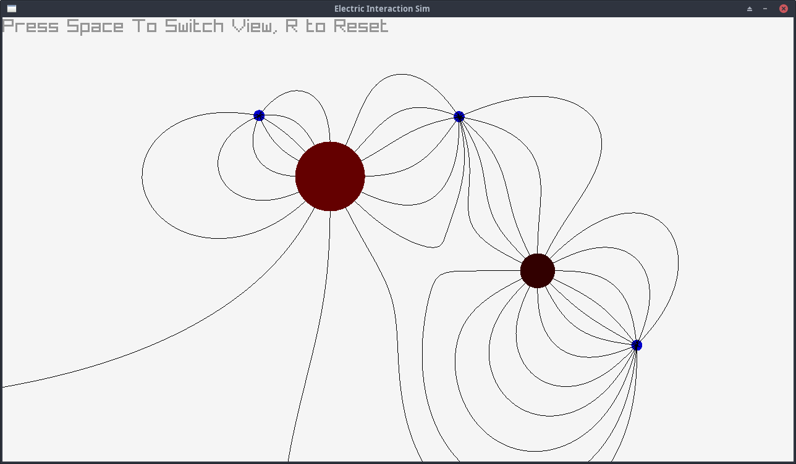

# Electric Point Charge Simulator

A simple program for watching positive and electric charges dance around each other, warping the electric field around them.

Made this in an afternoon. Hello PHY1004W 2023!

### Vector Field View

### Electric Line View

## Running it

Method 1:
1. Download the `electrosim.py` file in the `elec` directory.
2. Run the command `pip install raylib-py`
3. Run `python electrosim.py`

Method 2:
1. Clone/Download the repository, extract the contents
2. Run `poetry install` in the project directory (you may need to install [poetry](https://python-poetry.org/) first)
3. Run `poetry run python elec/electrosim.py`
